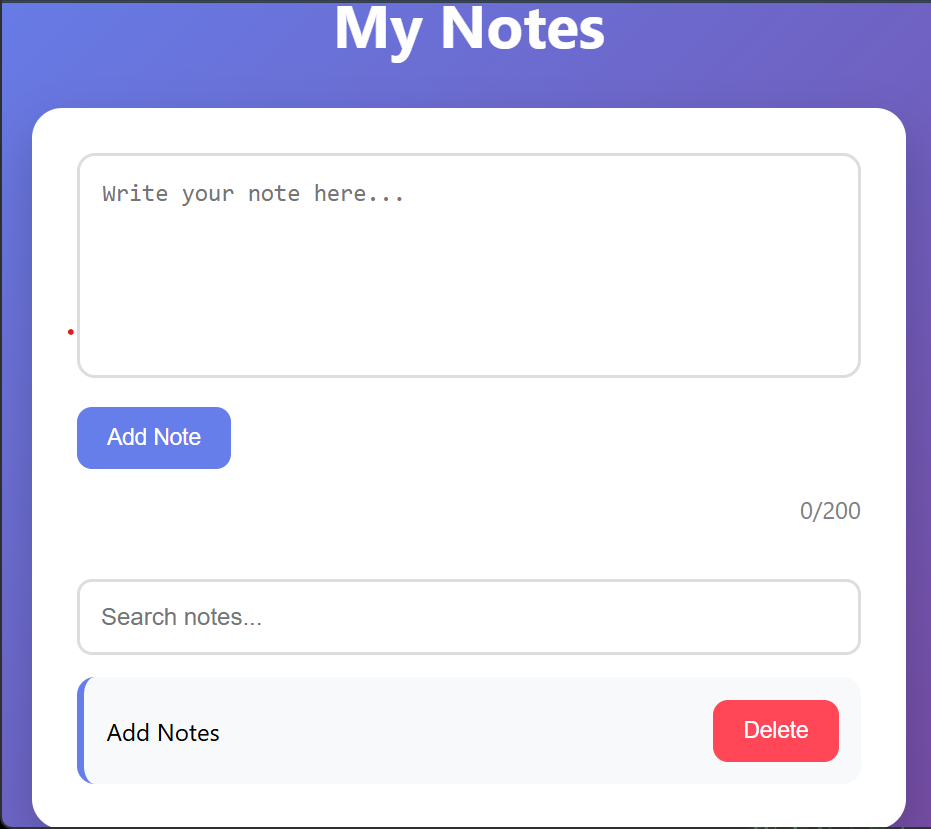

# 📝 Notes App

A simple notes application built with HTML, CSS, and JavaScript.

## 🚀 Features

- ✅ Add notes
- ✅Display notes
- ✅ Delete notes
- ✅ Clean and responsive UI
- ✅ Search notes
- ✅ Character counter (0/200)
- ✅ Confirmation before deleting
- ✅ Persistent storage using localStorage
- ✅ Unique IDs for each note
- ✅ 🌙 Dark mode

## 🛠️ Technologies Used

- HTML5
- CSS3
- JavaScript (DOM Manipulation)

## 📚 What I Learned

While building this project, I practiced:

- JavaScript arrays
- Functions
- DOM manipulation
- Event listeners
- Creating elements dynamically
- Array methods like `forEach()` and `splice()`

## 📸 Screenshot

## 🚀 Future Improvements

- 📌 Pin important notes
- 🏷️ Add note categories/tags
- 📅 Show creation & last edited date
- 📤 Export notes to a text file
- ☁️ Sync notes with a backend/database